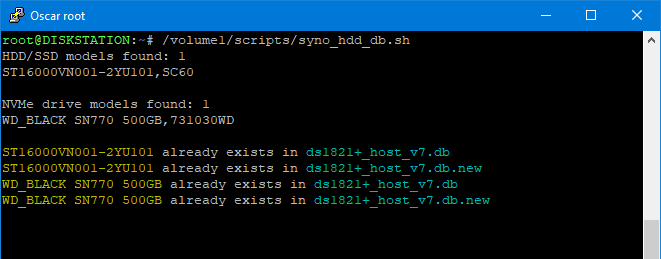

# Synology HDD db

<a href="https://github.com/007revad/Synology_HDD_db/releases"></a>
<a href="https://hits.seeyoufarm.com"></a>

### Description

Add your HDD, SSD and NVMe drives to your Synology's compatible drive database.

The script works in DSM 7 and DSM 6.

#### What the script does:

* Gets the Synology NAS model and DSM version (so it knows which db files to edit).
* Gets a list of the HDD, SSD and NVMe drives installed in your Synology NAS.
* Gets each drive's model number and firmware version.
* Backs up the database file if there is not backup already.
* Checks if each drive is already in the Synology's compatible-drive database.
* Adds any missing drives to the Synology's compatible-drive database.

**Planned updates:** 
* Detect any connected expansion units and get the model(s) and edit the correct expansion unit db files.
  * Or add support for users to specify their expansion unit model(s) as arguments.
  * Or maybe use the shotgun approach and update all expansion unit db files.
* Add support for SAS drives? Are SAS drives listed as /dev/sata# or /dev/sas# ?

### When to run the script

DSM updates wil almost certainly overwrite the drive-compatibility database files so you may need to run the script after every DSM update. You would also have to re-run the script after DSM downloads a newer version of the drive-compatibility database, which can happen between DSM updates. The best option is to run the script every time the Synology boots, and the best way to do that is to setup a scheduled task to run the the script at boot-up.

### Scheduling the script in Synology's Task Scheduler

See <a href=how_to_schedule.md/>How to schedule a script in Synology Task Manager</a>

### Running the script via SSH

You run the script in a shell with sudo or as root.

```YAML
sudo /path-to-script/syno_hdd_db.sh
```

**Note:** Replace /path-to-script/ with the actual path to the script on your Synology.

<p align="leftr"></p>

If you run the script with the -showedits flag it will show you the changes it made to the Synology's compatible-drive database. Obviously this is only useful if you run the script in a shell.

```YAML
sudo /path-to-script/syno_hdd_db.sh -showedits
```

**Note:** Replace /path-to-script/ with the actual path to the script on your Synology.

<p align="leftr"></p>

**Credits**

The idea for this script came from a comment made by Empyrealist on the Synology subreddit.
