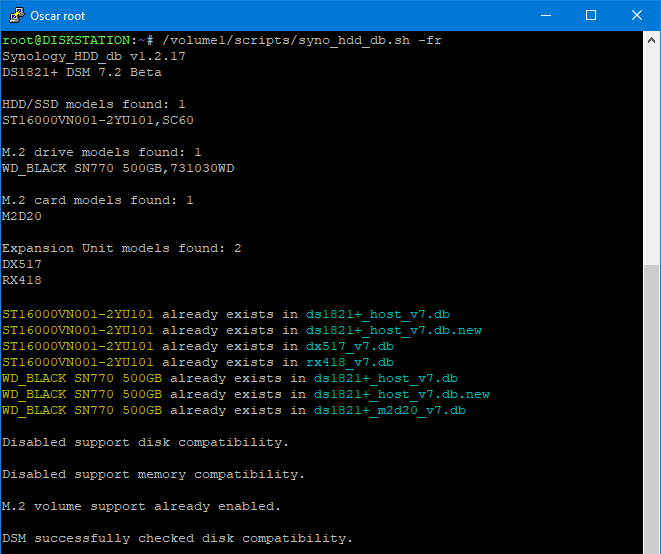
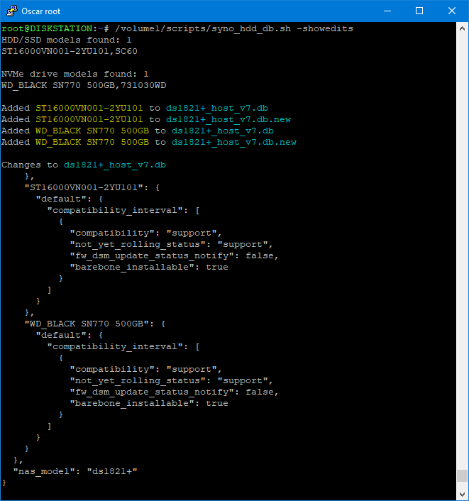
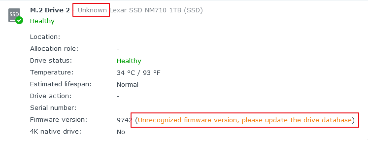
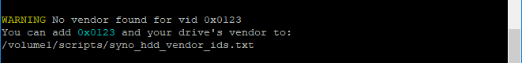

# Synology HDD db

<a href="https://github.com/007revad/Synology_HDD_db/releases"></a>
<a href="https://hits.seeyoufarm.com"></a>
[](https://www.paypal.com/paypalme/007revad)
[](https://github.com/sponsors/007revad)
[](https://user-badge.committers.top/australia/007revad)
<!-- [](https://user-badge.committers.top/australia_public/007revad) -->
<!-- [](https://user-badge.committers.top/australia_private/007revad) -->
<!-- [](https://github.com/007revad/Synology_HDD_db/releases) -->

### Description

Add your SATA or SAS HDDs and SSDs plus SATA and NVMe M.2 drives to your Synology's compatible drive databases, including your Synology M.2 PCIe card and Expansion Unit databases. 

The script works in DSM 7, including DSM 7.2, and DSM 6.

It also has a restore option to undo all the changes made by the script.

#### What the script does:

* Gets the Synology NAS model and DSM version (so it knows which db files to edit).
* Gets a list of the HDD, SSD, SAS and NVMe drives installed in your Synology NAS.
* Gets each drive's model number and firmware version.
* Backs up the database files if there is no backup already.
* Checks if each drive is already in the Synology's compatible-drive database.
* Adds any missing drives to the Synology's compatible-drive database.
* Optionally prevents DSM auto updating the drive database.
* Optionally disable DSM's "support_disk_compatibility".
* Optionally disable DSM's "support_memory_compatibility" to prevent <a href=images/ram_warning.png/>non-Synology memory notifications</a>.
* Optionally edits max supported memory to match the amount of memory installed, if installed memory is greater than the current max memory setting.
    * DSM only uses the max memory setting when calculating the reserved RAM area size for SSD caches.
* Optionally set write_mostly for your internal HDDs so DSM will normally read from your faster internal SSD(s).
    * It can automatically set DSM to read from your internal SSDs.
    * Or you can tell the script which internal drive(s) DSM should read from.
* Optionally disables Western Digital Device Analytics (aka WDDA) to prevent DSM showing a [warning for WD drives that are 3 years old](https://arstechnica.com/gadgets/2023/06/clearly-predatory-western-digital-sparks-panic-anger-for-age-shaming-hdds).
    * DSM 7.2.1 already has WDDA disabled.
* Enables M2D20, M2D18, M2D17 and E10M20-T1 if present on Synology NAS that don't officially support them.
    * Newer NAS models may also need [Synology_enable_M2_card](https://github.com/007revad/Synology_enable_M2_card)
* Checks that M.2 volume support is enabled (on models that have M.2 slots or PCIe slots).
* Enables creating M.2 storage pools and volumes from within Storage Manager in DSM 7.2 and later **(newer models only?)**.
    * Including M.2 drives in PCIe adaptor cards like M2D20, M2D18, M2D17 and E10M20-T1 for DSM 7.2 and above **(schedule the script to run boot)**.
* Optionally update IronWolf Health Monitor to v2.5.1 to support recent model IronWolf and IronWolf Pro drives. **(NAS with x86_64 CPUs only)**.
    * Installs IronWolf Health Management on '22 series and newer models that don't have IronWolf Health Management **(untested)**.
* Makes DSM recheck disk compatibility so rebooting is not needed if you don't have M.2 drives (DSM 7 only).
    * **If you have M.2 drives you may need to reboot.**
    * Reminds you that you may need to reboot the Synology after running the script.
* Checks if there is a newer version of this script and offers to download it for you.
  * The new version available messages time out so they don't prevent the script running if it is scheduled to run unattended.

### Download the script

1. Download the latest version _Source code (zip)_ from https://github.com/007revad/Synology_HDD_db/releases
2. Save the download zip file to a folder on the Synology.
    - Do ***NOT*** save the script to a M.2 volume. After a DSM or Storage Manager update the M.2 volume won't be available until after the script has run.
3. Unzip the zip file.

Or via SSH as your regular user:
```
cd $HOME
wget https://github.com/007revad/Synology_HDD_db/archive/refs/heads/main.zip -O syno_hdd_db.zip
7z x syno_hdd_db.zip
cd Synology_HDD_db-main && ls -ali
```

### Required files

The following files from the downloaded zip file must be in the same folder:

1. syno_hdd_db.sh
2. syno_hdd_vendor_ids.txt
3. dtc or the bin folder containing dtc (only required if you have a E10M20-T1, M2D20 or M2D18 in a NAS that does not support them).

### When to run the script

You would need to re-run the script after a DSM update. If you have DSM set to auto update the best option is to run the script every time the Synology boots, and the best way to do that is to <a href=how_to_schedule.md/>setup a scheduled task</a> to run the the script at boot-up.

**Note:** After you first run the script you may need to reboot the Synology to see the effect of the changes.

### Options when running the script <a name="options"></a>

There are optional flags you can use when running the script:
```YAML
  -s, --showedits       Show edits made to <model>_host db and db.new file(s)
  -n, --noupdate        Prevent DSM updating the compatible drive databases
  -r, --ram             Disable memory compatibility checking (DSM 7.x only)
                        and sets max memory to the amount of installed memory
  -f, --force           Force DSM to not check drive compatibility
                        Do not use this option unless absolutely needed
  -i, --incompatible    Change incompatible drives to supported
                        Do not use this option unless absolutely needed
  -w, --wdda            Disable WD Device Analytics to prevent DSM showing
                        a false warning for WD drives that are 3 years old
                          DSM 7.2.1 already has WDDA disabled
  -p, --pcie            Enable creating volumes on M2 in unknown PCIe adaptor
  -e, --email           Disable colored text in output scheduler emails
  -S, --ssd=DRIVE       Enable write_mostly on slow internal drives so DSM 
                        runs from the fast internal drive(s).
                          -S automatically sets internal SSDs as DSM preferred
                          --ssd=DRIVE requires the fast drive(s) as argument,
                          or restore as the argument to reset drives to default
                          --ssd=sata1 or --ssd=sata1,sata2 or --ssd=sda etc
                          --ssd=restore
      --restore         Undo all changes made by the script (except -S --ssd)
      --autoupdate=AGE  Auto update script (useful when script is scheduled)
                          AGE is how many days old a release must be before
                          auto-updating. AGE must be a number: 0 or greater
  -I, --ihm             Update IronWolf Health Monitor to 2.5.1 to support
                        recent model IronWolf and IronWolf Pro drives
  -h, --help            Show this help message
  -v, --version         Show the script version

  -s, --showedits       Show edits made to <model>_host db and db.new file(s)
  -n, --noupdate        Prevent DSM updating the compatible drive databases
  -r, --ram             Disable memory compatibility checking (DSM 7.x only)
                        and sets max memory to the amount of installed memory
  -f, --force           Force DSM to not check drive compatibility
                        Do not use this option unless absolutely needed
  -i, --incompatible    Change incompatible drives to supported
                        Do not use this option unless absolutely needed
  -w, --wdda            Disable WD Device Analytics to prevent DSM showing
                        a false warning for WD drives that are 3 years old
                          DSM 7.2.1 and later already has WDDA disabled
  -p, --pcie            Enable creating volumes on M2 in unknown PCIe adaptor
  -e, --email           Disable colored text in output scheduler emails
  -S, --ssd=DRIVE       Enable write_mostly on internal HDDs so DSM primarily 
                        reads from internal SSDs or your specified drives
                          -S automatically sets internal SSDs as DSM preferred
                          --ssd=DRIVE requires the fast drive(s) as argument,
                          or restore as the argument to reset drives to default
                          --ssd=sata1 or --ssd=sata1,sata2 or --ssd=sda etc
                          --ssd=restore
      --restore         Undo all changes made by the script (except -S --ssd)
                        To restore all changes including write_mostly use
                          --restore --ssd=restore
      --autoupdate=AGE  Auto update script (useful when script is scheduled)
                          AGE is how many days old a release must be before
                          auto-updating. AGE must be a number: 0 or greater
  -I, --ihm             Update IronWolf Health Management to 2.5.1 to support
                        recent model IronWolf and IronWolf Pro drives.
                        For NAS with x86_64 CPUs only.
                        Installs IHM on '22 series and newer models (untested)
  -h, --help            Show this help message
  -v, --version         Show the script version
```

**Notes:** 
- The -f or --force option is only needed if for some reason your drives still show as unsupported in storage manager.
    - Only use this option as last resort.
    - Using this option will prevent data deduplication from being available, and prevent firmware updates on Synology brand drives.
- If you have some Synology drives and want to update their firmware run the script **without** --noupdate or -n then do the drive database update from Storage Manager and finally run the script again with your preferred options.

### Scheduling the script in Synology's Task Scheduler

See <a href=how_to_schedule.md/>How to schedule a script in Synology Task Scheduler</a>

### Running the script via SSH

[How to enable SSH and login to DSM via SSH](https://kb.synology.com/en-global/DSM/tutorial/How_to_login_to_DSM_with_root_permission_via_SSH_Telnet)

You run the script in a shell with sudo -s or as root.

```YAML
sudo -s /path-to-script/syno_hdd_db.sh -nr
```

**Note:** Replace /path-to-script/ with the actual path to the script on your Synology.

<p align="left"></p>

If you run the script with the --showedits flag it will show you the changes it made to the Synology's compatible-drive database. Obviously this is only useful if you run the script in a shell.

```YAML
sudo -s /path-to-script/syno_hdd_db.sh -nr --showedits
```

**Note:** Replace /path-to-script/ with the actual path to the script on your Synology.

<p align="left"></p>

### Troubleshooting

| Issue | Cause | Solution |
|-------|-------|----------|
| /usr/bin/env: ‘bash\r’: No such file or directory | File has Mac line endings! | [Download latest zip file](https://github.com/007revad/Synology_HDD_db/releases) |
| Cursor sits there doing nothing | File has Windows line endings! | [Download latest zip file](https://github.com/007revad/Synology_HDD_db/releases) |
| syntax error near unexpected token | You downloaded the webpage! | [Download latest zip file](https://github.com/007revad/Synology_HDD_db/releases) |

If you get a "No such file or directory" error check the following:

1. Make sure you downloaded the zip or rar file to a folder on your Synology (not on your computer).
2. Make sure you unpacked the zip or rar file that you downloaded and are trying to run the syno_hdd_db.sh file.
3. If the path to the script contains any spaces you need to enclose the path/scriptname in double quotes:
   ```YAML
   sudo -s "/volume1/my scripts/syno_hdd_db.sh -n"
   ```
4. Set the script file as executable:
   ```YAML
   sudo chmod +x "/volume1/scripts/syno_hdd_db.sh"
   ```


### vendor_ids.txt

You only need to edit syno_hdd_vendor_ids.txt if the script warns you about a missing vendor id.

If DSM doesn't know the brand of your NVMe drives they will show up in Storage Manager as Unknown brand, and Unrecognised firmware version.

<p align="left"></p>

In this case the script will show you the vendor ID and advise you to add it to the syno_hdd_vendor_ids.txt file.

<p align="left"></p>

<br>

### Credits

- The idea for this script came from a comment made by Empyrealist on the Synology subreddit.
- Thanks for the assistance from Alex_of_Chaos on the Synology subreddit.
- Thanks to dwabraxus and aferende for help detecting connected expansion units.
- Thanks to bartoque on the Synology subreddit for the tip on making the script download the latest release from GitHub.
- Thanks to nicolerenee for pointing out the easiest way to enable creating M.2 storage pools and volumes in Storage Manager.
- Thanks to Xeroxxx for the writemostly suggestion and their writeup here: https://www.techspark.de/speed-up-synology-dsm-with-hdd-ssd/

### Donators

Thank you to the PayPal and Buy Me a Coffee donators, GitHub sponsors and hardware donators

|  |  |  |  | 
|--------------------|--------------------|----------------------|----------------------|
|  |  |  | Richard Wilhelm | 
| Mika255 | Ralf Edelwein | Martin | Alexander Habisreitinger | 
| jrn | Marcus Wojtusik | Will (war59312) | Christopher Maglio |
| Flow | Jake Morrison | tsnyder | zhangchi198 | 
| leadadri | Gary Plumbridge | frogger1805 | ctrlaltdelete | 
| CannotTouch | Kevin Staude | Alistair Hathaway | 8347 | 
| BrattishPlaque | Chris Bunnell | dansimau | Bsih | 
| Tim Trace | Michel VIEUX-PERNON | R De Jong | Rick | 
| Klaus-Dieter Fahlbusch | Amarand Agasi | someone61986 | Alexander Machatschek | 
| Yeong​Nuno | Joe | Torben Schreiter | Anthony McMurray | 
| Abhishek | Steven Haskell | Malte Müller | Aaron Thomas | 
| DENNIS BRAZIL | kunvanimals | Arnaud Costermans | dealchecker |
| Michael Carras | Alan | speedyyyyyy | Jordi Chavarria Fibla |
| Qwerty.xyz | Max | Mark Rohde | Someone |
| vaadmin | Sebastiaan Mulder | Nico Stark | Oleksandr Antonishak |
| Marcel Siemienowski | Dave Smart | dweagle79 | lingyinsam | 
| Vojtech Filkorn | Craig Sadler | Po-Chia Chen | Jean-François Fruhauf |
| Sven 'ctraltdelete' | Thomas Horn | Christian | Simon Azzouni |
| Lee Booy | Bünyamin Olgun | Hartmut Heinbach | Alexander Gundermann |
| Björn Schöninger | Nico Scherer | Patrick Hoekstra | Alex Joyce |
| Marcus Ackermann | Lorenz Schmid | enil-kil | Xaver Zöllner |
| Jan Bublitz | Darren O'Connor | Charles Young | J Davis | 
| Jürg Baiker | Joshua Gillispie | bizIT Hirschberg | Jordan Crawford |
| Tyler Teal | Voluntary Commerce LLC | Ez Hosting | Alec Wilhere |
| Reece Lyne | Enric Escudé Santana | Yunhao Zhang | Matthias Gerhardt |
| Darryl Harper | Mikescher | Matthias Pfaff | cpharada |
| Neil Tapp | zen1605 | Kleissner Investments | Angel Scandinavia |
| B Collins | Peter jackson | Mir Hekmat | Andrew Tapp |
| Peter Weißflog | Joseph Skup | Dirk Kurfuerst | Gareth Locke |
| Rory de Ruijter | Nathan O'Farrell | Harry Bos | Mark-Philipp Wolfger |
| Filip Kraus | John Pham | Alejandro Bribian Rix | Daniel Hofer |
| Bogdan-Stefan Rotariu | Kevin Boatswain | anschluss-org | Yemeth |
| Patrick Thomas | Manuel Marquez Corral | Evrard Franck | Chad Palmer |
| 侯​永政 | CHEN​HAN-YING | Eric Wells | Massimiliano Pesce |
| JasonEMartin | Gerrit Klussmann | Alain Aube | Robert Kraut |
| Charles-Edouard Poisnel | Oliver Busch | anonymous donors | private sponsors |
