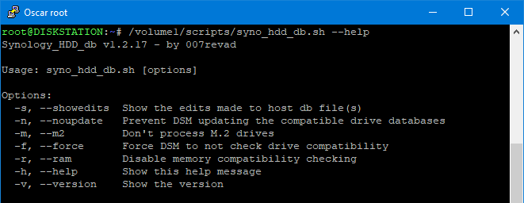

# Synology HDD db

<a href="https://github.com/007revad/Synology_HDD_db/releases"></a>
<a href="https://hits.seeyoufarm.com"></a>

### Description

Add your SATA or SAS HDDs and SSDs plus SATA and NVMe M.2 drives to your Synology's compatible drive databases, including your M.2 card and Expansion Unit databases. 

The script works in DSM 7 and DSM 6.

#### What the script does:

* Gets the Synology NAS model and DSM version (so it knows which db files to edit).
* Gets a list of the HDD, SSD, SAS and NVMe drives installed in your Synology NAS.
* Gets each drive's model number and firmware version.
* Backs up the database files if there is no backup already.
* Checks if each drive is already in the Synology's compatible-drive database.
* Adds any missing drives to the Synology's compatible-drive database.
* Prevents DSM auto updating the drive database.
* Optionally disable DSM's "support_disk_compatibility".
* Optionally disable DSM's "support_memory_compatibility".
* Checks that M.2 volume support is enabled (on supported models).
* Makes DSM recheck disk compatibility so rebooting is not needed (DSM 7 only).
* Reminds you that you may need to reboot the Synology after running the script (DSM 6 only).
* Checks if there is a newer version of this script and offers to download it for you.
  * The new version available messages time out so they don't prevent the script running if it is scheduled to run unattended.

**Planned updates:** 
* Allow unsupported M.2 drives for use as volumes in DSM 7.2 (for models that supported M.2 volumes).

### Download the script

See <a href=images/how_to_download.png/>How to download the script</a> for the easiest way to download the script.

### When to run the script

You would need to re-run the script after a DSM update. If you have DSM set to auto update the best option is to run the script every time the Synology boots, and the best way to do that is to setup a scheduled task to run the the script at boot-up.

**Note:** For DSM 6, after you first run the script you may need to reboot the Synology to see the effect of the changes.

### Options when running the script

There are optional flags you can use when running the script:
* --showedits or -s to show you the changes it made to the Synology's compatible-drive database.
* --noupdate or -n to prevent DSM updating the compatible drive databases.
* --m2 or -m to prevent processing M.2 drives.
* --force or -f to disable "support_disk_compatibility". This should only be needed if any of your drives weren't detected.
  * If you run the script without --force or -f it will re-eanble "support_disk_compatibility".
* --ram or -r to disable "support_memory_compatibility".
  * If you run the script without --ram or -r it will re-eanble "support_memory_compatibility".

<p align="leftr"></p>

### Scheduling the script in Synology's Task Scheduler

See <a href=how_to_schedule.md/>How to schedule a script in Synology Task Manager</a>

### Running the script via SSH

You run the script in a shell with sudo or as root.

```YAML
sudo /path-to-script/syno_hdd_db.sh
```

**Note:** Replace /path-to-script/ with the actual path to the script on your Synology.

<p align="leftr"></p>

If you run the script with the -showedits flag it will show you the changes it made to the Synology's compatible-drive database. Obviously this is only useful if you run the script in a shell.

```YAML
sudo /path-to-script/syno_hdd_db.sh -showedits
```

**Note:** Replace /path-to-script/ with the actual path to the script on your Synology.

<p align="leftr"></p>

**Credits**

- The idea for this script came from a comment made by Empyrealist on the Synology subreddit.
- Thanks for the assistance from Alex_of_Chaos on the Synology subreddit.
- Thanks to dwabraxus and aferende for help detecting connected expansion units.
- Thanks to bartoque on the Synology subreddit for the tip on making the script download the latest release from github.
